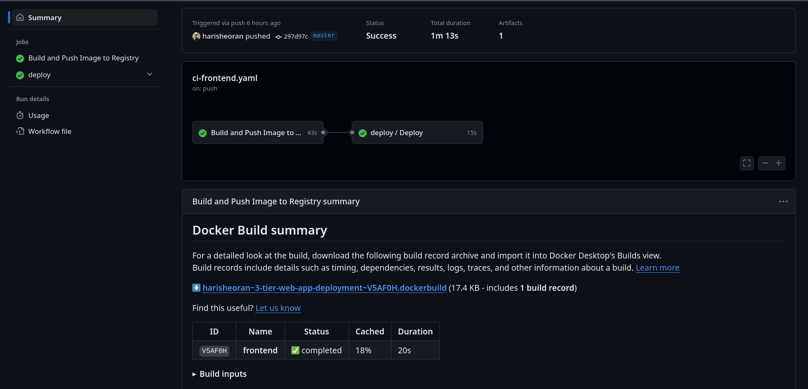

> Web application code belongs to this [source](https://github.com/mohammad-taheri1/Book-Store-MERN-Stack)

# Deployment Architecture


---
# Let's start Deploying in Production
We are going to deploy 3 Tier Web application on AWS in production.

***View Website***: https://sparrowbit.co/

(I used a spare domain)

> Alert!! For Production with security

Tech Stack
- Frontend: React
- Backend: Node JS
- Database MongoDB

We are deploying this web app in container environment

### Table of contents
- [Containerization]()
- [Running the containers: Docker compose]()
- [Secret handling]()
- [Protect Production code]()
- [Pipelines]()
    - [Code Scan Pipeline]()
    - [Main CI Pipeline]()
    - [CD Pipeline]()
- [Branch Protection]()
- [Build Infrastructure on AWS using Terraform]()
- [Domain]()
- [SSL Certificate: HTTPS connection]()

---

## Containerization

### Write Backend Dockerfile
We are using Node js in our backend.

> Warning! Do not pass any secret variable at build time, we'll provide them at runtime.

```
FROM node:20.16.0-bookworm-slim

ENV NODE_ENV=production

WORKDIR /app

COPY --chown=node:node package.json .

RUN npm install --only=production

COPY --chown=node:node . .

EXPOSE 8000

USER node

CMD [ "node", "index.js" ]
```

- Use Node JS image with specfic tag in prod, don't use latest tag, as if latest tag is new and if a new bug found in latest image, it might break your prod.

- We are not using alpine image, as it contians musl implemenation of C library, if your app's operations need C libraries then it might behave different, use *booksworm* image with slim, it is lightweight in size.

- use ```ENV NODE_ENV=production```, it'll make install dependencies for prod

- Set working directory, which will contain our code.

- First, copy only package json file, Why?

    - Docker use layer mechanism to build and when we do rebuild the image, it checks the changes in each layer and if no changes, it uses last build layer  and decrease the build time and dependecies don't change that much, so we put it first.

- ``` --chown=node:node ``` copy using only a specfic user, it won't give root permission, helps in security as root user has all previlages.

- Install production dependencies only, we dont dev dependencies in prod.

- Now, Copy all the code in current directory.

- Assign a new user, by default it uses root user which have all previlages so it can cause security issues.

- Start the server, don't use npm run in prod.

### Write Frontend Dockerfile 

In frontend we are using react, so we can build files which we can then serve in web server.

> Dont use ```npm run dev``` in production, its bad practice, instead build the static files and serve.

We are using Multi stage docker Build, In First stage, we'll build our react app and in 2nd stage we are using those build files and server them in web server, and in 2nd stage we dont need NodeJS, we copy only build files, it'll reduce our image size significantly.

> Eead more on Multi Stage Build on my [blog](https://harisheoran.github.io/devops/multi_stage_docker_go/).

```
FROM node:20.16.0-bookworm-slim AS build

WORKDIR /app

COPY --chown=node:node package.json .

RUN npm install --only=production

ENV PATH /app/node_modules/.bin:$PATH

COPY --chown=node:node . .

RUN npm run build

FROM nginx:1.27.0-alpine3.19 AS prod

COPY --from=build /app/dist /usr/share/nginx/html

RUN rm /etc/nginx/conf.d/default.conf

#COPY ./nginx.conf /etc/nginx/conf.d/default.conf

EXPOSE 3000

ENTRYPOINT ["nginx", "-g", "daemon off;"]
```

- ``` RUN npm run build ``` after Installing prod dependencies, build the react app, in my case I am using ***vite***.

- In 2nd stage, use nginx web server apline image, here this is light weight and we dont need c libraries, so we can use alpine image.

- Copy all the build file form 1st stage in 2nd stage.

- Remove default nginx config file, we'll provide our own at runtime.

- Start the nginx server.


> Put unnessary files which we don't need to run Contianer like .git, .gitignore, local builds in ```.dockerignore``` file.

## Creating and Starting the Containers.

### Secrets
We are going to pass secrets at runtime, so it won't be available to end user.

Ways to Pass secrets at runtime.
- ```env_file``` to provide the secret file.
- Volumes: We can use bind mounts volume to mount(kind of sync) to the contatiner directory.

### Networks
Our user needs to access only Fronted, not the database directly, so we are going to use one more security layer by putting our containers in different networks.


We create 2 networks,
- *Frontend Network*: In this Network, we'll ran frontend and backend container.
- *Backend Network*: In this Network, we'll ran backend and database container.

This create a layer of separation in out frontend and database, and backend can talk to both database and frotend, it enhances security.

### Database Docker Compose
Mongo Db container requires 2 secrets, Database username and password, store them in a ```.env``` file, (Don't push it to GitHub, put it in gitignore)

```
  database:
    image: mongo
    ports:
      - "27017:27017"
    env_file:
      - ./env/.env.db
    volumes:
      - my-db:/data/db
    healthcheck:
      test: echo 'db.runCommand("ping").ok' | mongosh localhost:27017/test --quiet
      interval: 3s
      retries: 5
      start_period: 30s
    networks:
      - backend
    deploy:
      restart_policy:
        condition: on-failure
```

- First, Image, ports, env_file.
- Volume to store the database data on host machine, this creates a volume on Host machine. Why ?
> Containers are ephemeral in nature means they can be destroyed and created, so any data in those conatiner will be lost.
> Using Volumes, we can save that data in host machine and if container destroyed, start the new container with same volume.


> Warning! Using database in container with volumes is not the way for prod, what if the host machine goes down.

- Put simple health check by pinging the db.
- Put this in Backend Network.
- Restart policy incase the container got crashed.

### Backend Container


```
  backend:
    image: harisheoran/backend_img:master
    ports:
      - "8000:8000"
    env_file:
      - ./env/.env
    depends_on:
      - database
    networks:
      - backend
      - frontend
    deploy:
      restart_policy:
        condition: on-failure
```

- Define image, env file, ports, networks.
- ```depends_on``` this create order of starting the containers, so before starting backend container it'll check if database container is created and running, this prevent *failure* as if we start backend with checking db, it wont be connected to a DB, so prevents a failure.

### Frontend Container

```
  frontend:
    image: harisheoran/frontend_img:master
    ports:
      - "3000:3000"
    networks:
      - frontend
    deploy:
      restart_policy:
        condition: on-failure
    volumes:
      - ./nginx/nginx.conf:/etc/nginx/conf.d/nginx.conf:ro
```
- Define image, ports, network
- Mounting secrets using ***Bind Mount Volume*** (It is basically sync the Host directories/files with the Containers, it does not create a volume on Host like the database Volume.)

- ```ro``` this defines that files are with *readonly* permissions, it helps in security, if somebody got access to our container, then they are unable to write this file.

### Define Volume & Networks

```
volumes:
  my-db:

networks:
  frontend:
    driver: bridge
  backend:
    driver: bridge
```

- Define Volume for Database.
- Define Networks, Docker use bridge Network internally.

## Branch Protection
Use GitHub branch protection rule to protect prod branch, in our case,
- Don't push to prod branch directly without raising PR.
- Can't merge before test completions.


> Here my prod branch is *master* branch.

## CI Pipelines
We are using *GitHub Actions* for creating pipelines.


### Pipeline Secrets Management
- Use GitHub Action secrets to store pipelines secrets.

### 1. Code scan Pipeline
We dont want to break our production with basd code, so we can test the code before merging to main, so far we dont have Tests for our code, so we scan our code for any vulnerabilities with *codeql*

[view the pipeline](https://github.com/harisheoran/3-tier-web-app-deployment/blob/cicd/.github/workflows/codeql.yml)

### 2. Main Prod CI pipeline
We want to build the code once merged to *main* branch and push the image to registry and scan the image.

**Steps**
- Define the *triggering event*, in our case, we want to run the pipeline on code merged/push to main branch
- Define on which OS, we are going to run our jobs.
- Define required Permissions.
- Checkout the repo on machine(Github provide)
- Setup *buildx* to build the image, this new buildx helps in caching the image also by layer, Our layering strategy will pay off here by reducing our build time.
- Login to Image registry, we are using Docker Hub.(Save the Login credentials as secret in Github Actions Secrets)
- Extract Metadata and labels to provide tag to image, in our case, we are using branch name as tag, we can also use *tag* or custom tags.
- Build and Push the image using the Dockerfile, here we are also using *GitHub API* for caching for faster builds.
- Scan the Image using trivy.
- Tiggers the CD Pipeline.

> [View Pipelines YAML](https://github.com/harisheoran/3-tier-web-app-deployment/blob/cicd/.github/workflows/ci-backend.yaml) or [All Pipelines files](https://github.com/harisheoran/3-tier-web-app-deployment/tree/cicd/.github/workflows)

### 3. CD Pipeline
> Docker don't have a dedicated tools like *Argo* to implement GitFlow

***Steps***
- SSH into the AWS EC2 using a SSH action 
    - Generate SSH Keys on your local machine.
    - Copy content of public key to AWS EC2 authorized_keys file.
    - Save content of private key in GitHub actions secret.
    - Save other secrets - Host username, password, ssh port.

- Ran the docker commands to update the containers.
    - Pull the latest Image
    - Run the compose file
    - delete old container and images.


### Create Infrastructure using Terraform

Crete infra on AWS, see the [code here](https://github.com/harisheoran/3-tier-web-app-deployment/tree/cicd/iac-terraform)

## Set Up Nginx as reverse Proxy with SSL certificate
- Setup Nginx as revere proxy 
```
server {
    server_name sparrowbit.co;
    location / {
        proxy_pass http://127.0.0.1:3000;
        proxy_set_header Host $host;
        proxy_set_header X-Real-IP $remote_addr;
        proxy_set_header X-Forwarded-For $proxy_add_x_forwarded_for;
        proxy_set_header X-Forwarded-Proto $scheme;
    } 
}
```

- Setup DNS records in your Domain provider Dashboard, use *A* record to save IPv4 address of ec2 instance.
- Install SSL certificate usign Certbot, you can do this using AWS itself, {read my blog](https://harisheoran.github.io/projects/aws_resume/) to do in AWS.


## Main Challeneges


## Yet to Implement
- Server config management using Ansible.
- Testing of Prod Infra.
- Orchestration system for scaling.
- Secure VPC.
- Branching Strategy
- Releasing Pipelines.
